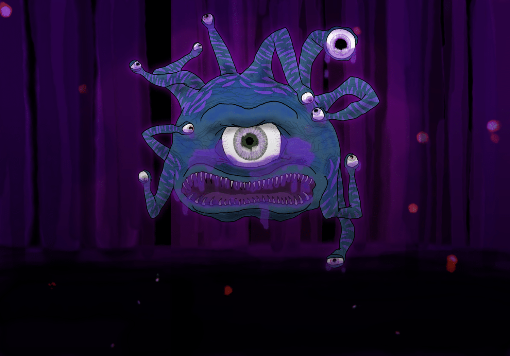

# Murexian Beholder

#### Lore

It is a strange scenario indeed for a beholder to allow itself to become corrupted by murex. This might occur if the beholder was driven out of its lair and was forced to flee, finding itself in the Murexian Grove and subsisting on the tainted flesh of the beasts found there to survive. Or it may have been a conscious decision, some play to take in these powerful toxins to use against its real or perceived foes. The ambitions of a beholder are sometimes difficult to predict, and a beholder prefers it this way.

However it came to be, the beholder will find not only its body infused with murex, but also its mind. The poison clouds thought and judgment, twisting the beholder's innate paranoia. The aberrant mind becomes more so, reducing the beholder's intelligence and making it fearful of anything it encounters, thinking that it has discovered an agent of its foes. Such a beholder will generally try to kill creatures on the spot rather than converse or negotiate terms. It still makes an effort to anticipate its enemies' next actions, but it becomes a generally less effective tactician.

Murexian beholders will happily make their new surroundings into a lair, tending to create vast tunnels underground amidst the mexite deposits from ancient volcanic activity. Their slaves dig until they hit magma flows, so that the beholder might better protect its interests through ever more hazardous pathways.

<figure>
  
  <figcaption>Murexian Beholder by <a href="https://mario.panighetti.net">Mario Panighetti</a></figcaption>
</figure>

#### Attributes

_Large aberration/monstrosity, lawful evil_

- **Armor Class** 18 (natural armor)
- **Hit Points** 180 (19d10 + 76)
- **Speed** 0 ft., fly 20 ft. (hover)

|  STR  |  DEX  |  CON  |  INT  |  WIS  |  CHA  |
|:-----:|:-----:|:-----:|:-----:|:-----:|:-----:|
|10 (+0)|14 (+2)|18 (+4)|13 (+1)|15 (+2)|17 (+3)|

- **Saving Throws** INT +6, WIS +7, CHA +8
- **Skills** Perception +12
- **Damage Immunities** poison (including murexian poison)
- **Condition Immunities** poisoned (including murexian poison), prone
- **Senses** darkvision 120 ft., passive Perception 22
- **Languages** Deep Speech, Undercommon
- **Challenge** 13 (10,000 XP) **Proficiency Bonus** +5

#### Special Traits

_**Antimagic Cone.**_ The beholder's central eye creates an area of antimagic, as in the antimagic field spell, in a 150-foot-cone. At the start of each of its turns, the beholder decides which way the cone faces and whether the cone is active. The area works against the beholder's own eye rays.

_**Murexian Poison.**_ All murexian poison damage and poisoned conditions dealt by the beholder treat poison immunity as poison resistance and ignore a target's normal poison resistance, unless the target has specific resistance or immunity to murexian poisons. Targets with poison immunity or murexian poison resistance have advantage on saves against murexian poisons, and targets with murexian poison immunity automatically succeed on such saves.

_**Venom Surge.**_ If another creature comes into direct contact with the beholder's body (including as part of the beholder's Bite attack), it must succeed on a DC 18 Constitution saving throw or become poisoned with murex for 1 minute and paralyzed until the end of its next turn. A poisoned creature no longer in direct contact with the beholder can repeat the saving throw at the end of each of its turns, ending the effect on itself on a success.

Additionally, a creature that is already poisoned by murex and fails this saving throw instead suffers one level of exhaustion. A creature cannot have more than one level of exhaustion at a time caused by the Venom Surge trait from the same murexian creature.

#### Actions

_**Bite.**_ _Melee Weapon Attack:_ +5 to hit, reach 5 ft., one target. _Hit:_ 14 (4d6) piercing damage plus 14 (4d6) murexian poison damage.

_**Eye Rays.**_ The beholder shoots three of its magical eye rays at random (reroll duplicates), choosing one to three targets it can see within 120 feet of it. See the beholder stat block in the _Monster Manual_ for eye ray effects; the Enervation Ray is replaced with a Murexian Ray which behaves as follows:

_Murexian Ray._ The targeted creature must make a DC 18 Constitution saving throw. On a failed save, the target takes 36 (8d8) murexian poison damage and is poisoned by murex as described in the Venom Surge trait. On a successful save, the ray damage is halved and the target is not poisoned by murex.

#### Legendary Actions

The beholder can take 3 legendary actions, using the Eye Ray option below. It can take only one legendary action at a time and only at the end of another creature’s turn. The beholder regains spent legendary actions at the start of its turn.

**Eye Ray.** The beholder uses one random eye ray.

---

_Source: [Mote](https://github.com/mpanighetti/dnd5e-mote)_
