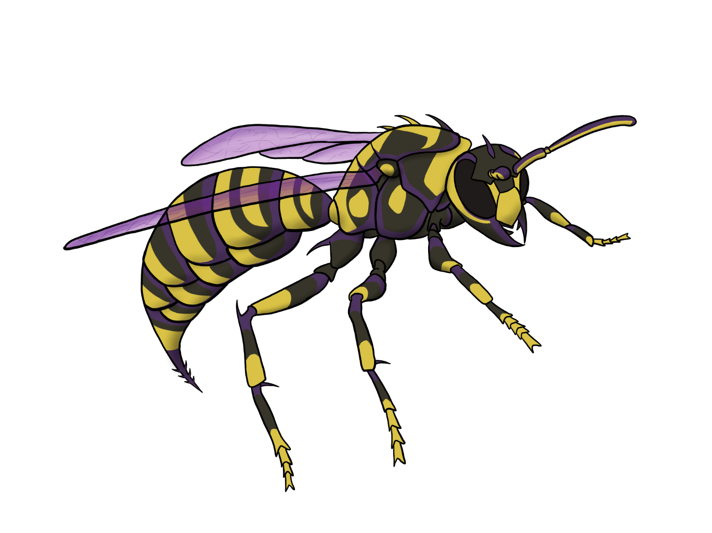

### Murexian Hellwasp

<figure>
  
  <figcaption>Murexian Hellwasp by <a href="https://tigerlilynoh.tumblr.com">TigerLilyNoh</a></figcaption>
</figure>

#### Attributes

_Large fiend/monstrosity, lawful evil_

- **Armor Class** 19 (natural armor)
- **Hit Points** 52 (8d10 + 8)
- **Speed** 10 ft., fly 60 ft. (hover)

|  STR  |  DEX  |  CON  |  INT  |  WIS  | CHA  |
|:-----:|:-----:|:-----:|:-----:|:-----:|:----:|
|18 (+4)|15 (+2)|12 (+1)|10 (+0)|10 (+0)|7 (-2)|

- **Saving Throws** DEX +5, WIS +3
- **Damage Vulnerabilities** cold
- **Damage Immunities** fire, poison (including murexian poison)
- **Condition Immunities** poisoned (including murexian poison)
- **Senses** darkvision 60 ft., passive Perception 10
- **Languages** Infernal, telepathy 300 ft. (with other hellwasps only)
- **Challenge** 5 (1,800 XP) **Proficiency Bonus** +3

#### Special Traits

_**Magic Weapons.**_ The hellwasp's weapon attacks are magical.

_**Murexian Poison.**_ All murexian poison damage and poisoned conditions dealt by the hellwasp treat poison immunity as poison resistance and ignore a target's normal poison resistance, unless the target has specific resistance or immunity to murexian poisons. Targets with poison immunity or murexian poison resistance have advantage on saves against murexian poisons, and targets with murexian poison immunity automatically succeed on such saves.

_**Enhanced Poisonous Skin.**_ If another creature comes into direct contact with the hellwasp's body (including as part of the hellwasp's Sting or Sword Talons attacks), it must succeed on a DC 15 Constitution Saving Throw or become poisoned with murex for 1 minute and paralyzed until the end of its next turn. A poisoned creature no longer in direct contact with the hellwasp can repeat the Saving Throw at the end of each of its turns, ending the effect on itself on a success.

#### Actions

_**Multiattack.**_ The hellwasp makes two attacks: one with its sting and one with its sword talons.

_**Sting.**_ _Melee Weapon Attack:_ +7 to hit, reach 5 ft., one creature. _Hit:_ 8 (1d8 + 4) piercing damage plus 7 (2d6) fire damage and 3 (1d6) murexian poison damage.

_**Sword Talons.**_ _Melee Weapon Attack:_ +7 to hit, reach 5 ft., one target. _Hit:_ 11 (2d6 + 4) piercing damage plus 3 (1d6) murexian poison damage.

---

_Source: [Mote](https://github.com/mpanighetti/dnd5e-mote)_
