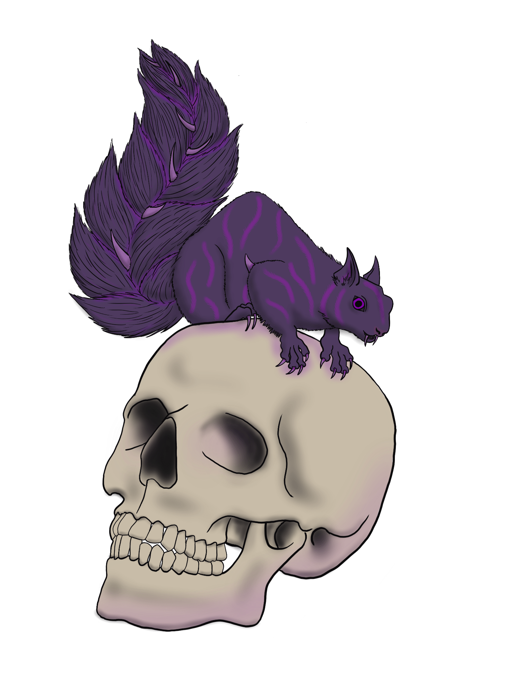

# Murexian Squirrel

<figure>
  
  <figcaption>Murexian Squirrel by <a href="https://tigerlilynoh.tumblr.com">TigerLilyNoh</a></figcaption>
</figure>

#### Attributes

_Tiny beast/monstrosity, unaligned_

- **Armor Class** 10
- **Hit Points** 1 (1d4 - 1)
- **Speed** 20 ft., climb 30 ft.

| STR  |  DEX  | CON  | INT  |  WIS  | CHA  |
|:----:|:-----:|:----:|:----:|:-----:|:----:|
|2 (-4)|11 (+0)|9 (-1)|2 (-4)|10 (+0)|4 (-3)|

- **Damage Immunities** poison (including murexian poison)
- **Condition Immunities** poisoned (including murexian poison)
- **Senses** darkvision, passive Perception 10
- **Languages** —
- **Challenge** 0 (10 XP) **Proficiency Bonus** +2

#### Special Traits

_**Keen Smell.**_ The squirrel has advantage on Wisdom (Perception) checks that rely on smell.

_**Pack Tactics.**_ The squirrel has advantage on attack rolls against a creature if at least one of the squirrel's allies is within 5 feet of the creature and isn't incapacitated.

_**Poisonous Skin.**_ If another creature comes into direct contact with the squirrel's body (including as part of the squirrel's Bite attack), it must succeed on a DC 9 Constitution Saving Throw or become poisoned with murex for 1 minute. A poisoned creature no longer in direct contact with the squirrel can repeat the Saving Throw at the end of each of its turns, ending the effect on itself on a success.

#### Actions

_**Bite.**_ _Melee Weapon Attack:_ +0 to hit, reach 5 ft., one target. _Hit:_ 1 piercing damage.

---

_Source: [Mote](https://github.com/mpanighetti/dnd5e-mote)_
